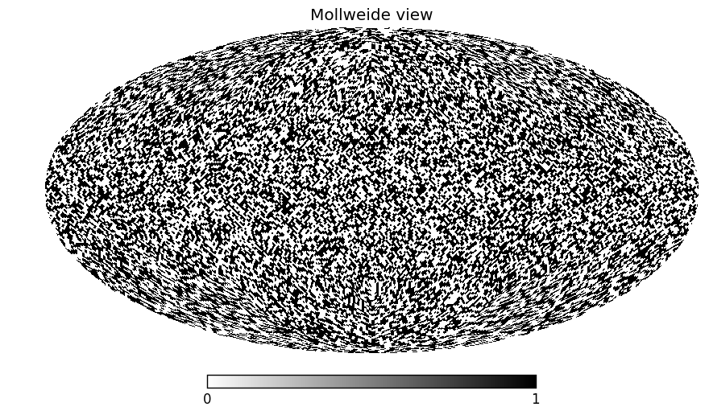
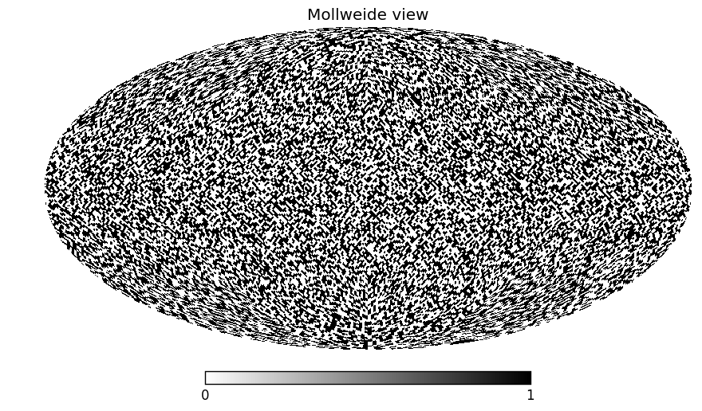
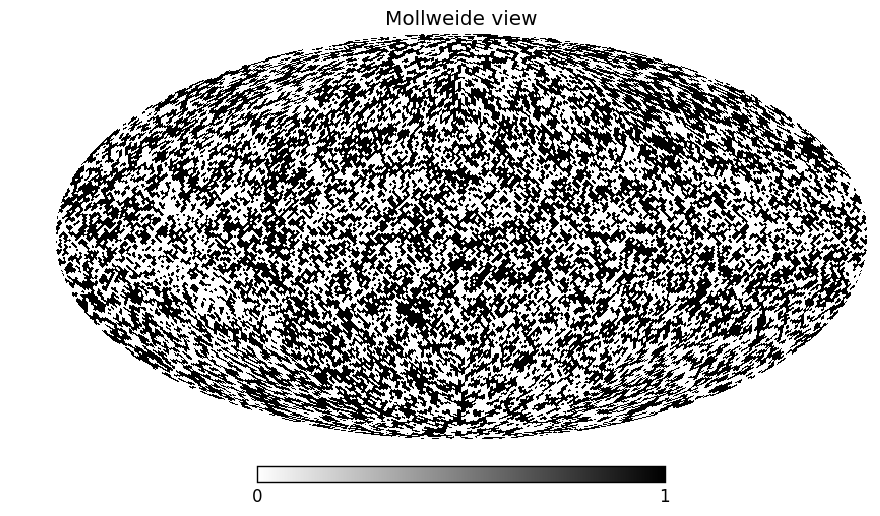
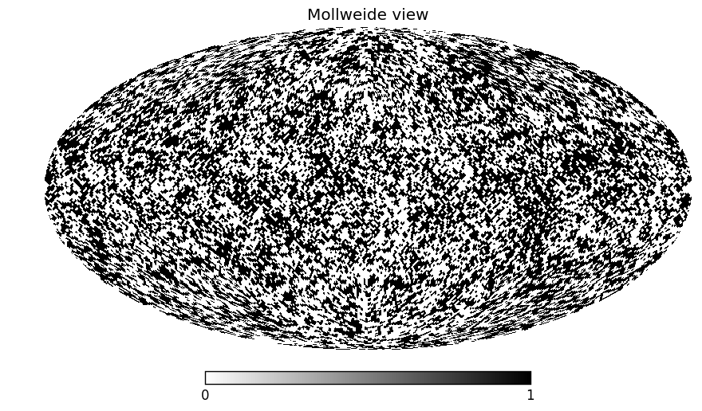
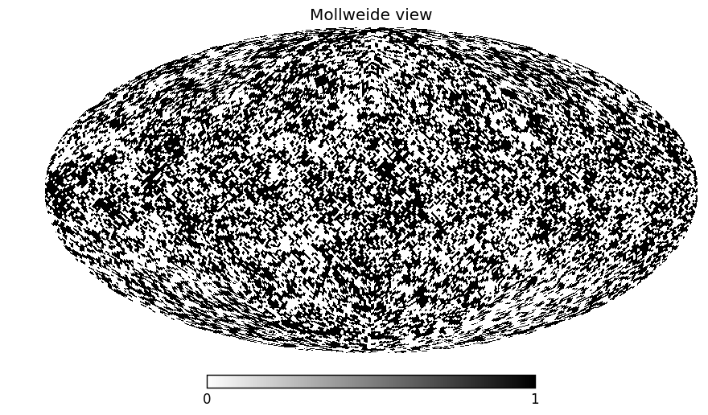
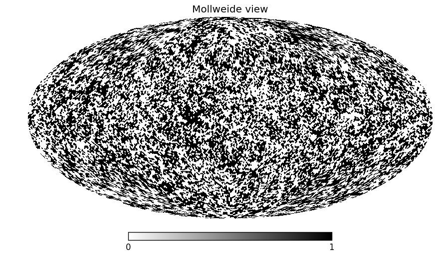
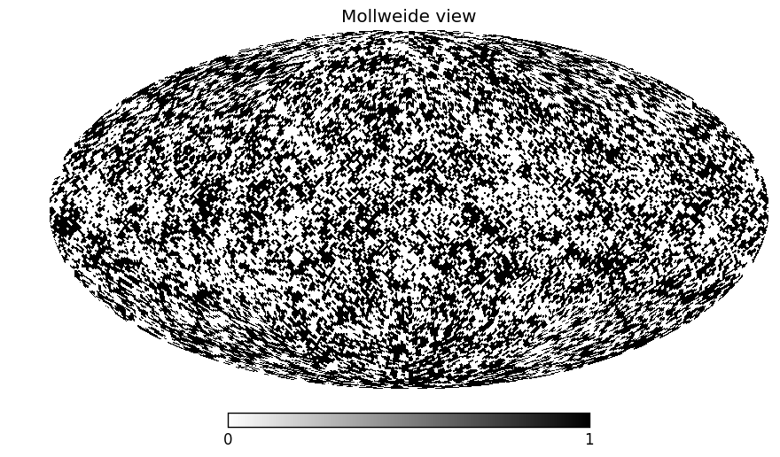
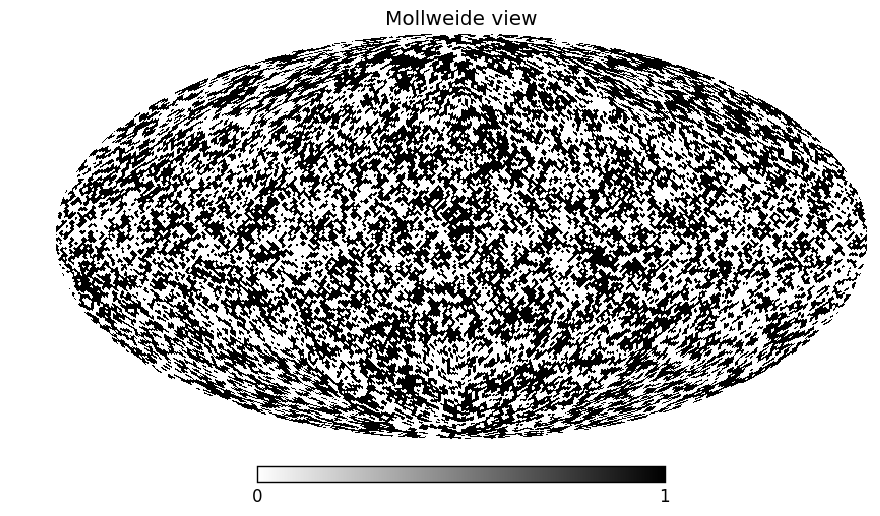
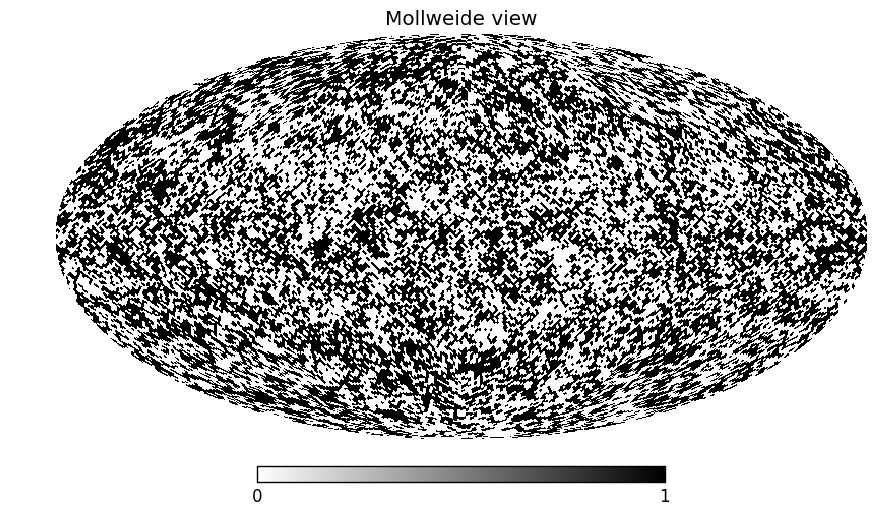

The clumpy sky of AGN
==============================

Produce sky maps consistent with cloud eclipse events.

Markowitz+14 observed a powerlaw of eclipse durations, with index ~0.8.
If we translate this to (keplerian) rotations on the sky, this corresponds
to the correlation of one point in the sky to another.

Here we produce sky maps following this correlation.

Illustrations
======================

Powerlaw with index 0 (flat):

Powerlaw with index -0.5 (negative):

Powerlaw with index +0.5 (positive):

Powerlaw with index +0.8 (real relation):

Powerlaw with index +1.5 (more extreme):

